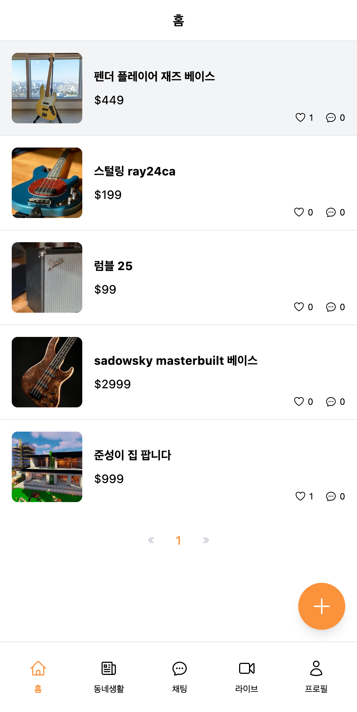
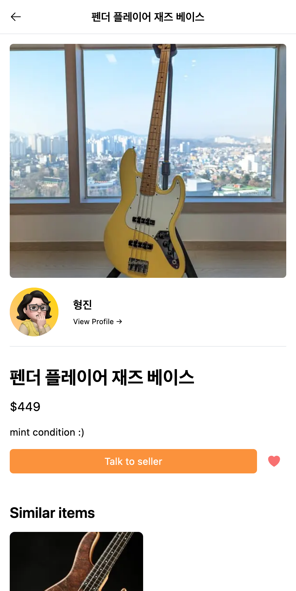
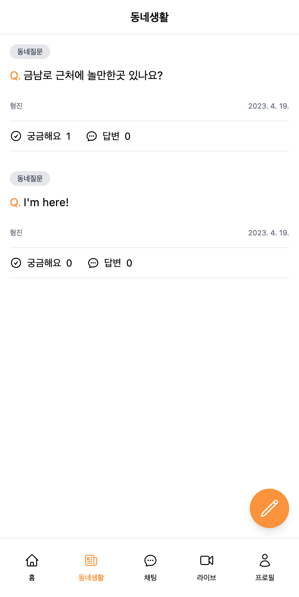
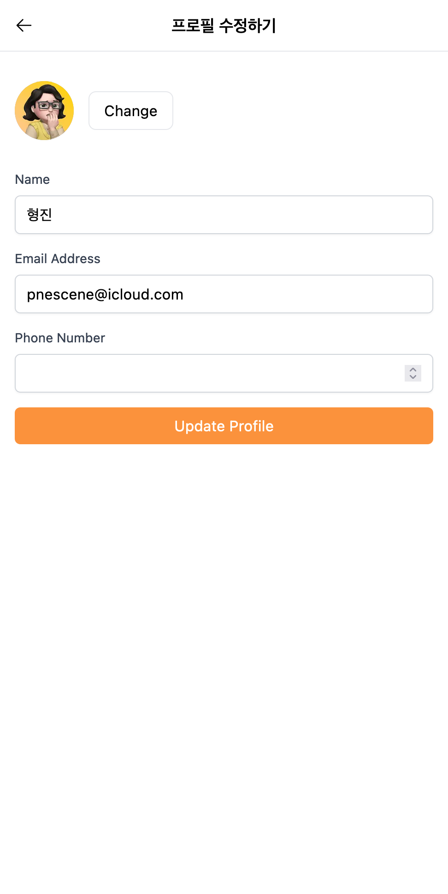

  

<h1 align="center">
  당근마켓 클론 프로젝트 (in development 👨‍🔧)
</h1>

  
  
  
  

## 🥕 Introductions

Karrot Market (the most popular buy and sell platform in Korea) clone project, based on web technologies.

## 🔧 Stacks

- TypeScript
- Next.js
- SWR
- Iron Session
- Tailwind CSS
- Prisma
- PlanetScale

## 🚀 Deploy

- Deploy with Vercel
